# Three Ways of Generating Terrain with Erosion Features

## Background

Terrain generation has long been a popular topic in the procedural generation community, with applications in video games and movies. Some games use procedural terrain to generate novel environments on the fly for the player to explore. Others use procedural terrain as a tool for artists to use when crafting a believable world. 

The most common way of representing array is a 2D grid of height values. This type of terrain doesn't allow for overhangs and caves, but at large scales those features are not very apparent. The most popular terrain generation algorithms focus on adding together different layers of [coherent noise](http://libnoise.sourceforge.net/coherentnoise/index.html), which can be thought of as smoothed random noise. Several popular choices for coherent noise are:

* [**Perlin noise**](https://en.wikipedia.org/wiki/Perlin_noise) - A form of [gradient noise](https://en.wikipedia.org/wiki/Gradient_noise) on a rectangular lattice.
* [**Simplex noise**](https://en.wikipedia.org/wiki/Simplex_noise) - Like Perlin noise, but on a simplex lattice.
* [**Value noise**](https://en.wikipedia.org/wiki/Value_noise) - Basically just white noise that's been upscaled and interpolated.

If you take several layers of coherent noise, each at different levels of detail and with different amplitudes, you get a rough pattern frequently (and mostly inaccurately) called [**fBm**](https://en.wikipedia.org/wiki/Brownian_surface) (fractional Brownian motion). [This page](https://www.redblobgames.com/maps/terrain-from-noise/) provides a good overview for how this process works. 

In addition, there are other methods of generating fBm more directly, including:

* [**Diamond-square**](https://en.wikipedia.org/wiki/Diamond-square_algorithm) - A fast, but artifact-prone divide-and-conquer approach.
* **Power-law noise** - Created by filtering white noise in the frequency domain with a power-law function.

What you get from regular fBm terrain is something like this:

<p align="center">
  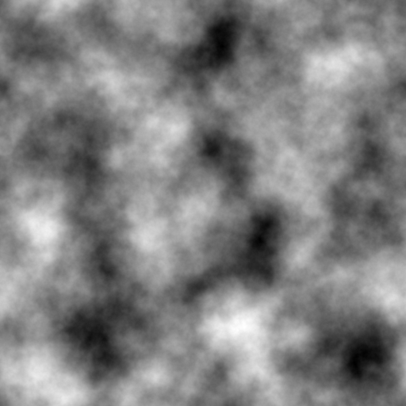
  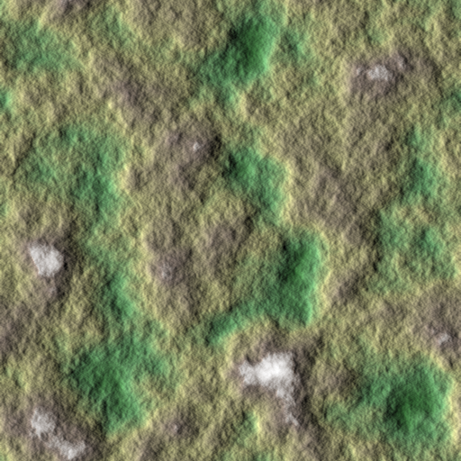
  <br>
  <em> Typical fBm-based terrain. Left is height as grayscale, right is with coloration and hillshading. </em>
</p>


This gives reasonable looking terrain at a quick glance. It generates distinguishable mountains and valleys, and has a general roughness one expects from rocky terrain.

However, it is also fairly boring. The fractal nature of fBm means everything more or less looks the same. Once you've seen one patch of land, you've basically seen it all. 

One method of adding a more organic look to terrain is to perform [domain warping](http://www.iquilezles.org/www/articles/warp/warp.htm), which is where you take regular fBm noise but offset each point by another fBm noise map. What you get is terrain that looks warped and twisted, somewhat resembling terrain that has been deformed by tectonic movement. The game No Man's Sky uses domain warping for its custom noise function called [uber noise](https://youtu.be/SePDzis8HqY?t=1547).

<p align="center">
  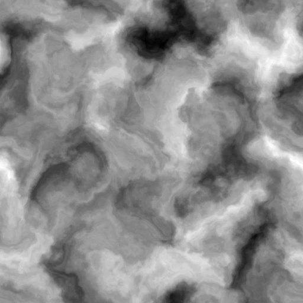
  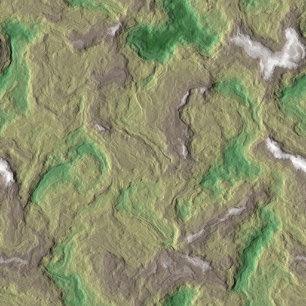
  <br><em> fBm with domain warping </em>
</p>

Another way of spicing up fBm is to modify each coherent noise layer before adding them together. For instance, if you take the absolute value of each coherent noise layer, and invert the final result you can get a mountain ridge effect: 

<p align="center">
  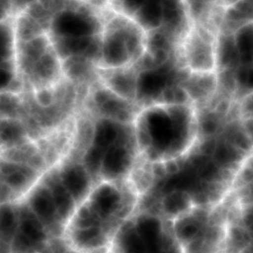
  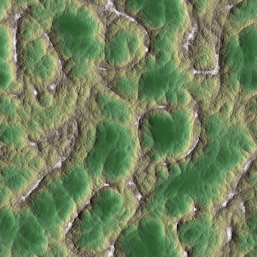
  <br><em> Modified fBm to create mountain ridges. </em>
</p>

These all look iteratively more convincing. However, if you look at actual elevation maps, you will notice that these look nothing like real life terrain:

<p align="center">
  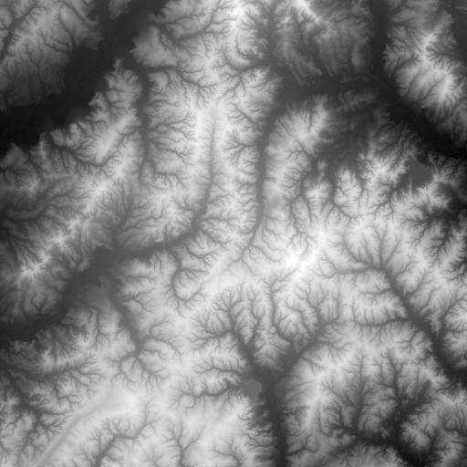
  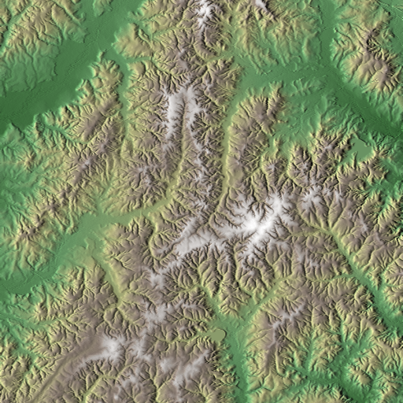
  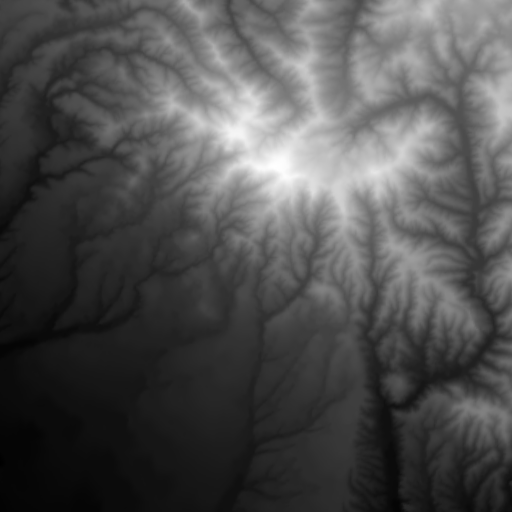
  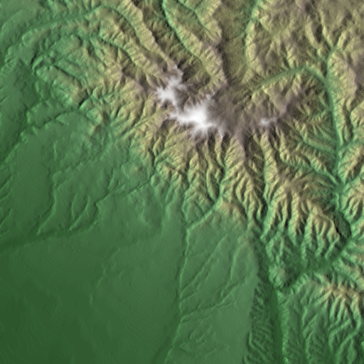

  <br><em> Elevation maps from somewhere in the continental United States (credit to the USGS). The right images uses the same coloration as above, for consistency. </em>
</p>

The fractal shapes you see in real life terrain are driven by **erosion**: the set of processes that describe terrain displacement over time. There are several types of erosion, but the one that most significantly causes those fractal shapes you see is **hydraulic erosion**, which is basically the process of terrain displacement via water. As water flows across terrain, it takes sediment with it and deposits it downhill. This has the effect of carving out mountains and creating smooth valleys. The fractal pattern emerges from smaller streams merging into larger streams and rivers as they flow downhill.

Unfortunately, more involved techniques are required to generate terrain with convincing erosion patterns. The following three sections will go over three distinct methods of generating eroded terrain. Each method has their pros and cons, so take that into consideration if you want to include them in your terrain project.


## Simulation

If real life erosion is driven by physical processes, couldn't we just simulate those processes to generate terrain with erosion? Then answer is, yes! The mechanics of hydraulic erosion, in particular, are well known and are fairly easily to simulate.

The basic idea of hydraulic erosion is that water dissolves terrain into sediment, which is then transported downhill and deposited. Programmatically, this means tracking the following quantities:

* **Terrain height** - The rock layer that we're interested in.
* **Water level** - How much water is at each grid point.
* **Sediment level** - The amount of sediment suspended in water.

When simulating, we make small changes to these quantities repeatedly until the erosion features emerge in our terrain.

To start off, we initiate the water and sediment levels to zero. The initial terrain height is seeded to some prior height map, frequently just regular fBm.

Each simulation iteration involves the following steps:

1. **Increment the water level** (as in via precipitation). For this I used a simple uniform random distribution, although some approaches use individual water "droplets".
1. **Compute the terrain gradient.** This is used to determine where water and sediment will flow, as well as the velocity of water at each point.
1. **Determine the sediment capacity** for each point. This is affected by the terrain slope, water velocity, and water volume. 
1. **Erode or deposit sediment**. If the sediment level is above the capacity, then sediment is deposited to terrain. Otherwise, terrain is eroded into sediment.
1. **Displace water and sediment downhill.** 
1. **Evaporate** some fraction of the water away.


Apply this process for long enough and you may get something like this:

<p align="center">
  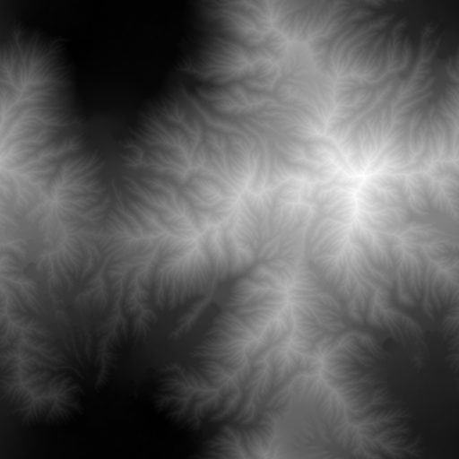
  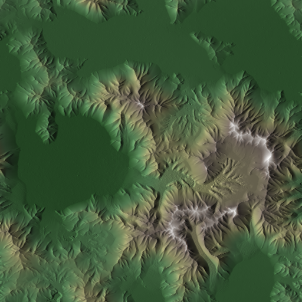
  <br><em>Terrain from simulated erosion. See <a href="https://drive.google.com/file/d/1iz3xl71qOVcPaSMZ95JyfXIU9exDy8TV/view?usp=sharing">here</a> for a time lapse.</em>
</p>

The results are fairly convincing. The tendril-like shape of ridges and cuts you see in real-life terrain are readily apparent. What also jumps out are the large, flat valleys that are the result of sediment deposition over time. If this simulation were left to continue indefinitely, eventually all mountains would be eroded into these flat sedimentary valleys.

Because of results like you see above, this method of generating terrain can be seen in professional terrain-authoring tools. The code for the terrain above is largely a vectorized implementation of the code found on [this page](http://ranmantaru.com/blog/2011/10/08/water-erosion-on-heightmap-terrain/). For a more theoretical approach, check out this [paper](https://hal.inria.fr/inria-00402079/document).


### Pros

* Lot of real-life terrain features simply emerge from running these rules, including stream downcutting, smooth valleys, and differential erosion.
* Instead of using global parameter values, different regions can be parameterized differently to develop distinct terrain features (e.g. deserts can evolve differently than forests).
* Fairly easy to parallelize given how straightforward vectorization is.

### Cons

* Parameter hell. There are around 10 constants that need to be set, in addition to other factors like the precipitation pattern and the initial terrain shape. Small changes to any of these can produce completely different results, so it can be difficult to find the ideal combination of parameters that produces good results.
* Fairly inefficient. Given an NxN grid, in order for changes on one side of the map to affect the opposite size you need O(N) iterations, which puts the overall runtime at O(N<sup>3</sup>). This means that doubling the grid dimension can result in 8x execution time. This performance cost further exacerbates the cost of parameter tweaking.
* Difficult to utilize to produce novel terrain. The results of simulation all look like reasonable approximations of real life terrain, however extending this to new types of terrain requires an understanding of the physical processes that would give way to that terrain, which can be prohibitively difficult. 


## Machine Learning

Machine learning is frequently uses as a panacea for all sorts of problems, and terrain generation is no exception. Machine learning can be effective so long as you have lots of compute power and a large, diverse dataset. Fortunately, compute power is easy to acquire, and lots of terrain elevation data is readily available to download.
 
The most suitable machine learning approach is to use a **Generative Adversarial Network (GAN)**. GANs are able to produce fairly convincing novel instances of a distribution described by training data. It works via two neural networks: one that produces new instances of the distribution (called the "generator"), and another whose job is to determine whether a provided terrain sample is real (i.e. from the training set), or fake (i.e. via the generator). For some more technical background, check out [these Stanford lectures](https://www.youtube.com/playlist?list=PL3FW7Lu3i5JvHM8ljYj-zLfQRF3EO8sYv).

Creating the right network and tuning all the different hyperparameters can be difficult and requires a lot of expertise to get right. Instead of creating the network from scratch, I will be building off of the work done for *Progressive Growing of GANs for Improved Quality, Stability, and Variation* by Karras, et al. ([paper](https://arxiv.org/pdf/1710.10196.pdf), [code](https://github.com/tkarras/progressive_growing_of_gans)). The basic approach of this paper is to train the network on lower resolution versions of the training samples while adding new layers for progressively higher resolutions. This makes the network converge quicker for high resolution images than it would if training from full resolution images to begin with.

### Training

Like with almost all machine learning projects, most effort is spent in data gathering, cleaning, validation, and training. 

The first step is to get real life terrain height data. For this demonstration, I used the [National Elevation Dataset (NED)](https://lta.cr.usgs.gov/NED) by the USGS. The dataset I used consists of ~1000 1x1 degree height maps with resolutions of 3600x3600 (i.e. pixel size of 1 arcsecond<sup>2</sup>).

From these height maps I will take 512x512 samples for use in training. In the source height arrays, each pixel is a square arcsecond, which means that each sample as-is will appear horizontally stretched, since a square arcsecond is spatially narrower than it is tall. After compensating for this, I also apply several heuristics to filter out what are likely sample unsuitable for training:

* Only accept samples who minimum and maximum elevation span a certain threshold. This approach prefers samples that are more "mountainous", and will therefore produce more noticeable erosion effects.
* Ignore samples if a certain percentage of grid points are within a certain margin of the sample's minimum elevation. This filters out samples that are largely flat, or ones that consist mostly of water.
* Ignore samples whose [Shannon entropy](https://en.wikipedia.org/wiki/Entropy_(information_theory)) is below a certain threshold. This helps filter out samples that have been corrupted (perhaps due to different libraries used to encode and decode the height data).

In addition, if we assume that terrain features do not have a directional preference, we can rotate each sample by 90° increments as well as flipping it to increase the dataset size by 8x. In the end, this nets us around 180,000 training samples.

These training samples are then used to train the GAN. Even using progressively grown GANs, this will still take quite a while to complete (expect around a week even with a beefy Nvidia Tesla GPU).

[Here](https://drive.google.com/file/d/1zdlgpkQu2zqWKJr23di73-lc3hJBAfqW/view?usp=sharing) is a timelapse video several terrain samples throughout the training process.


### Results

Once the network is trained, all we need to do is feed it a new random latent vector into the generator to create new terrain samples:

<p align="center">
  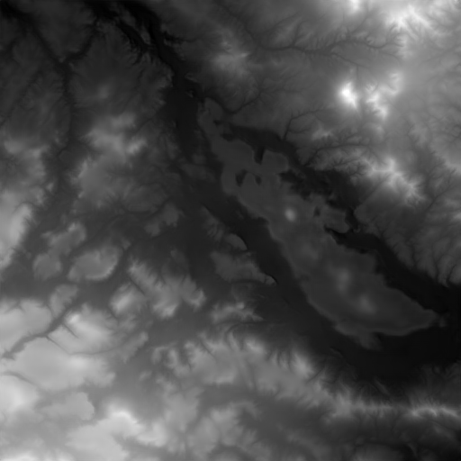
  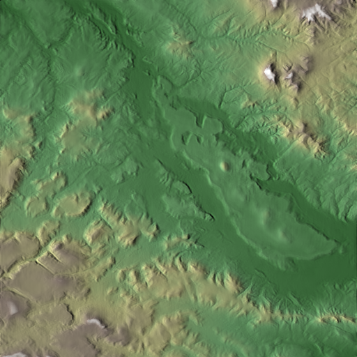
  <br>
  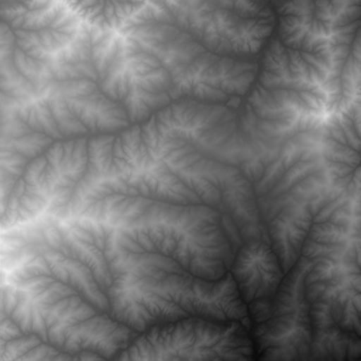
  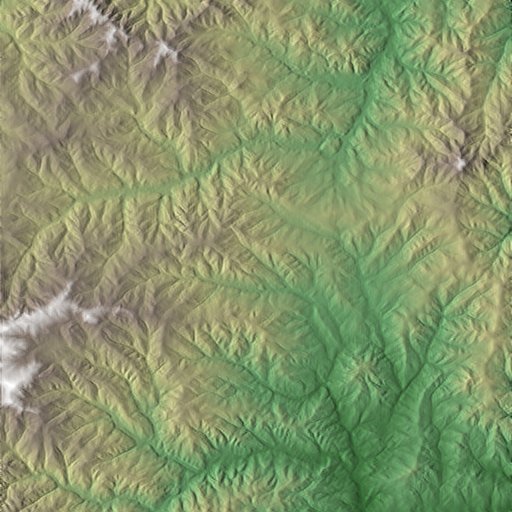
  <br>
  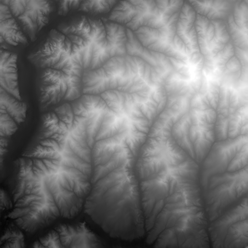
  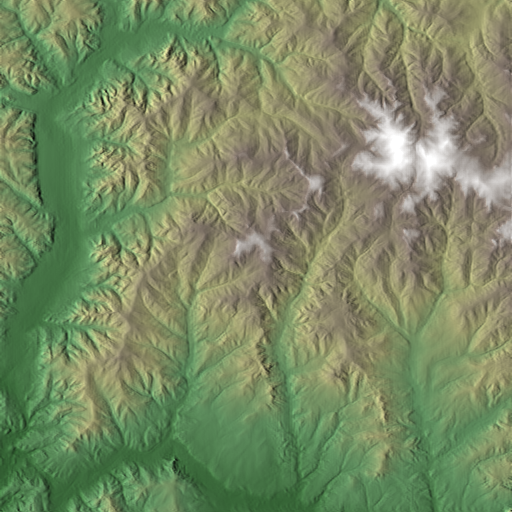
  <br>
  
  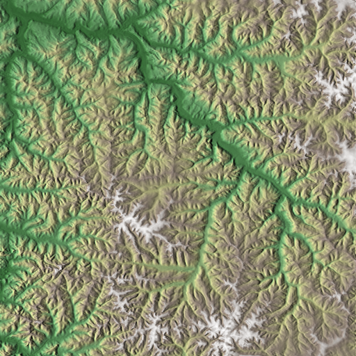
  <br>
  
  
  <em>ML-generated terrain.</em>
</p>


### Pros

* Generated terrain is basically indistinguishable from real-world elevation data. It captures not just erosion effects, but many other natural phenomena that shape terrain in nature.
* Generation is fairly efficient. Once you have a trained network, creating new terrain samples is fairly fast.

### Cons

* Training is *very* expensive (both in time and money). Lot of effort is required to acquire, clean, validate, and finally train the network. It took about 8 days to train the network used in the above examples.
* Very little control over the final product. The quality of generated terrain is basically driven by the training samples. Not only do you need a large number of training samples to generate good terrain, you also need good heuristics to make sure that each training sample is suitable. Because training takes so long, it isn't really practical to iterate on these heuristics to generate good results.
* Difficult to scale to higher resolutions. GANs are generally good a low resolution images. It gets much more expensive, both in terms of compute and memory costs, to scale up to higher resolution height maps.


## River Networks

In most procedural erosion techniques, terrain is carved out first and river placement happens afterward. An alternative method is to work backward: first generate where rivers and streams will be located, and from there determine how the terrain would be shaped to match the rivers. This eases the burden of creating river-friendly terrain by simply defining where the rivers are up front and working the terrain around them.

### Creating the River Network

Every stream eventually terminates somewhere, most frequently the ocean (they occasionally drain into inland bodies of water, but we will be ignoring those; these drainage basins are called [endorheic basins](https://en.wikipedia.org/wiki/Endorheic_basin)). Given that we need some ocean to drain into, this terrain will be generated as an island,

First we start off with what regions will be land or water. Using some simple fBm filtering, we get something like this:

<p align="center">
  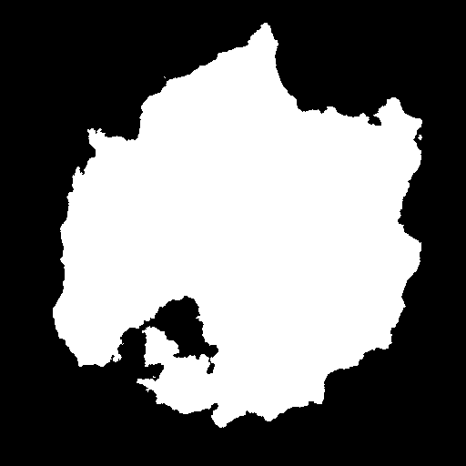
  <br><em>Land mask. Black is ocean, and white is land.</em>
</p>

The next step is to define the nodes on which the river network will be generated. A straightforward approach is to assign a node to each (x, y) coordinate of the image, however this has a tendency to create horizontal and vertical artifacts in the final product. Instead will we create out nodes by sampling some random points across the grid using [Poisson disc sampling](https://www.jasondavies.com/poisson-disc/). After that we use [Delaunay triangulation](https://en.wikipedia.org/wiki/Delaunay_triangulation) to connect the nodes.

<p align="center">
  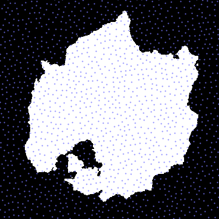
  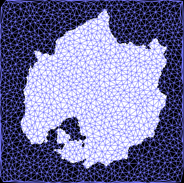
  <br><em>Left are points via Poisson disc sampling. Right is their Delaunay triangulation.<br>
  The point spacing in these images is larger than what is used to generate the final terrain.
  </em>
</p>

Next, we generate the generic shape the terrain will have (which will later be "carved out" via erosion). Because endorheic basins are being avoided in this demo, this terrain is generated such that each point has a downhill path to the ocean (i.e. no landlocked valleys). Here is an example of such a shape:

<p align="center">
  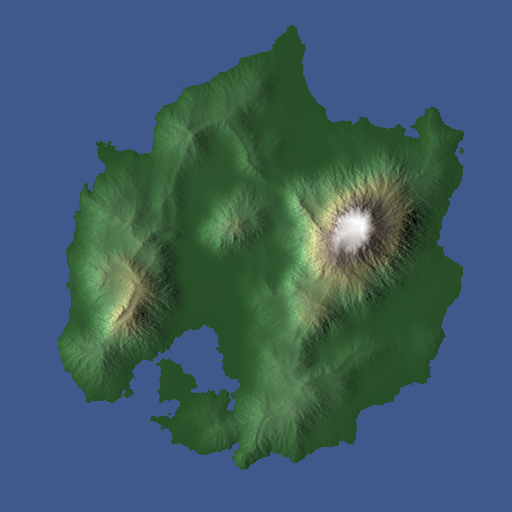
  <br><em>Initial shape our terrain will take.</em>
</p>

The next step is to generate the river network. The general approach is to generate rivers starting from the mouth (i.e. where they terminate in the ocean) and growing the graph upstream one edge at a time until no more valid edges are left. A valid edge is one that:

* Moves uphill. Since we are growing the river graphs upstream, the end effect is only downhill-flowing rivers.
* Does not reconnect with an existing river graph. This results in rivers that only merge as they flow downhill, but never split.

Furthermore, we also prioritize which edge to add by how much it aligns with the previous edge in the graph. Without this, rivers will twist and turn in ways that don't appear natural. Furthermore, amount of "directional inertia" for each edge can be configured to get more twisty or straight rivers.

<p align="center">
  
  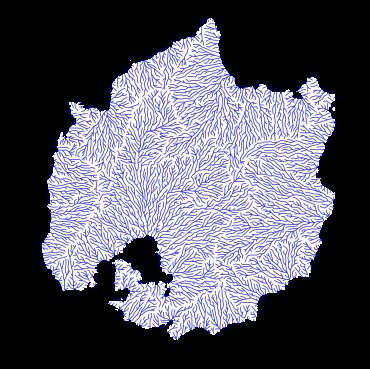
  <br><em>River networks. Left and right have low and high directional inertia, respectively.</em>
</p>

After this, the water volume for each node in the river graph is calculated. This is basically done by giving each node a base water volume and adding the sum of all upstream nodes' volumes.

<p align="center">
  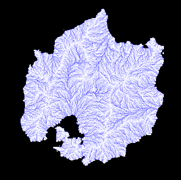
  <br><em>River network with water volume.</em>
</p>


### Generating the Terrain

The next step is to generate the terrain height to match the river network. Each node of the river network graph will be assigned a height that will then be rendered via triangulation to get the final  height map as a 2D grid.

The graph traversal move uphill, starting from the water level. Each time an edge is traversed, the height of the next node will be proportional to the height difference in the initial terrain height generated earlier, scaled inversely by the volume of water along that edge. Furthermore, we will cap the height delta between any two nodes to give a thermal-erosion-like effect.

Traversing only the river network edges will produce discontinuities in the generated height, since no two distinct river "trees" can communicate with each other. When traversing, we will have to also allow traversing edges that span different river trees. For these edges, we simply assume the edge's water volume to be zero.

In the end, you get something like this:

<p align="center">
  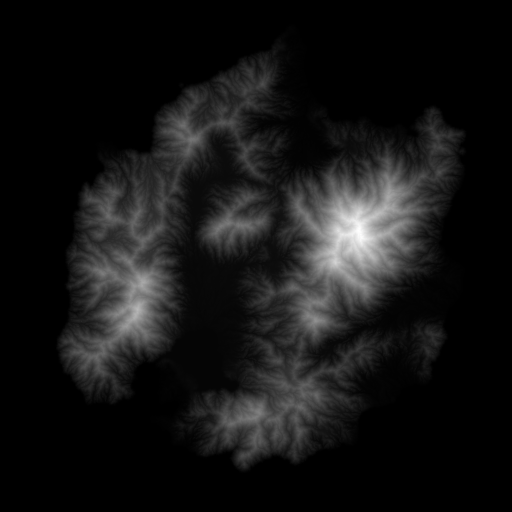
  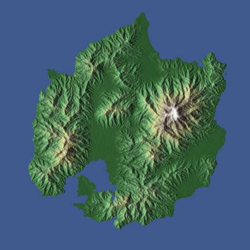
  <br><em>Final terrain height map from river networks.</em>
</p>

If you're interested in an approach that blends river networks and simulation, check out [this paper](https://hal.inria.fr/hal-01262376/document).

### Pros

* Creates very convincing erosion-like ridges and cuts. The shape of the river network can easily be seen in the generated height map.
* Easy to add rivers if desired given the already-generated river network.
* Fairly efficient. Given an NxN height map, this algorithm takes O(N<sup>2</sup>log N) time.

### Cons

* This algorithm is good at carving out mountains, but needs work to generate other erosion effects like sediment deposition and differential erosion.
* Some of the algorithms used in this approach are a bit more difficult to parallelize (e.g. best first search).


## Running the Code

All the examples were generated with Python 3.6.0 using Numpy. I've gotten this code to work on OSX and Linux, but I haven't tried with Windows.

Most of the height maps above are generated by running a single python script, with the exception of machine learning which is a bit more involved (described farther down).

Here is a breakdown of all the simple terrain-generating scripts. All outputs are 512x512 grids.

| File | Output | Description
|:--- | :--- | :---
| `plain_old_fbm.py` | `fbm.npy` | Regular fBm
| `domain_warping.py` | `domain_warping.npy` | fBm with domain warping
| `ridge_noise.py` | `ridge.npy` | The noise with ridge-like effects seen above.
| `simulation.py` | `simulation.npy` | Eroded terrain via simulation.
| `river_network.py` | `river_network.npz` | Eroded terrain using river networks. The NPZ file also contains the height map

To generate the images used in this demo, use the `make_grayscale_image.py` and `make_hillshaded_image.py` scripts. Example: `python3 make_hillshaded_image.py input.npy output.png`


### Machine Learning

The machine learning examples are all heavily dependent on the [Progressive Growing of GANs](https://github.com/tkarras/progressive_growing_of_gans) project, so make sure to clone that repository. That project uses Tensorflow, and requires that you run on a machine with a GPU. If you have a GPU but Tensorflow doesn't see it, you probably have driver issues.

#### Creating the Training Data 

If you wish to train a custom network, you can use whatever source of data you want. For the above examples, I used the USGS.

The first step is to get the list of URLs pointing to the elevation data:

1. Go to the USGS [download application](https://viewer.nationalmap.gov/basic/)
1. Select the area from which you want to get elevation data.
1. On the left under **Data**, select **Elevation Product (3DEP)**, then **1 arc-second DEM**. You can choose other resolutions, but I found 1 arcsecond to be adequate.
1. Under **File Format**, make sure to select **IMG**.
1. Click on the **Find Products** button.
1. Click **Save as CSV**. If you wish to use your own download manager, also click **Save as Text**.

The next step is to download the actual elevation data. You can either use the `python3 download_ned_zips.py <downloaded CSV file>` which will download the files in the `zip_files/` directory. The USGS site gives this [guide](https://viewer.nationalmap.gov/uget-instructions/) to downloading the files via uGet.

The next step is to convert the elevation data from IMG files in a ZIP archive to Numpy array files. You can do this by calling `python3 extract_height_arrays.py <downloaded CSV file>`. This will write the Numpy arrays to the `array_files/` directory.

After this, run `python3 generate_training_images.py`, which will go through each array in the `array_files/` directory, and create 512x512 training sample images from it (written to the `training_samples/` directory). This script performs the validation and filtering described above. It also takes a long time to run, so brew a pot of coffee before you kick it off.

The next steps will require that you cloned the `progressive_growing_of_gans` project. First, you need to generate the training data in the `tfrecords` format. This can be done by calling:

`progressive_growing_of_gans/: python3 dataset_tool.py /path/to/erosion_3_ways datasets/terrain`

I chose `terrain` as the output directory, but you can use whatever you want (just make sure it's in the `datasets/` directory.

Almost there! The next step is to edit `config.py` and add the following line to the dataset section:

`desc += '-terrain'; dataset = EasyDict(tfrecord_dir='terrain')`

Make sure to uncomment/delete the "celebahq" line. 

Now, you can finally run `python3 train.py`. Even with a good graphics card, this will take days to run. For further training customizations, check out [this section](https://github.com/tkarras/progressive_growing_of_gans#preparing-datasets-for-training).

When you're done, the `results/` directory will contain all sorts of training outputs, including progress images, Tensorboard logs, and (most importantly) the PKL files containing the network weights.

#### Generating Terrain Samples

To generate samples, run the following script:

```python3 generate_ml_output.py path/to/progressive_growing_of_gans network_weights.pkl 10```

The arguments are:

1. The path to the cloned `progressive_growing_of_gans` repository.
1. The network weights file (the one used for this demo can be found [here](https://drive.google.com/file/d/1czHFcF2ZG_lki7TAQyYCoqtsVcJmdCUN/view?usp=sharing)).
1. The number of terrain samples to generate (optional, defaults to 20)

The outputs are written to the `ml_outputs` directory.
